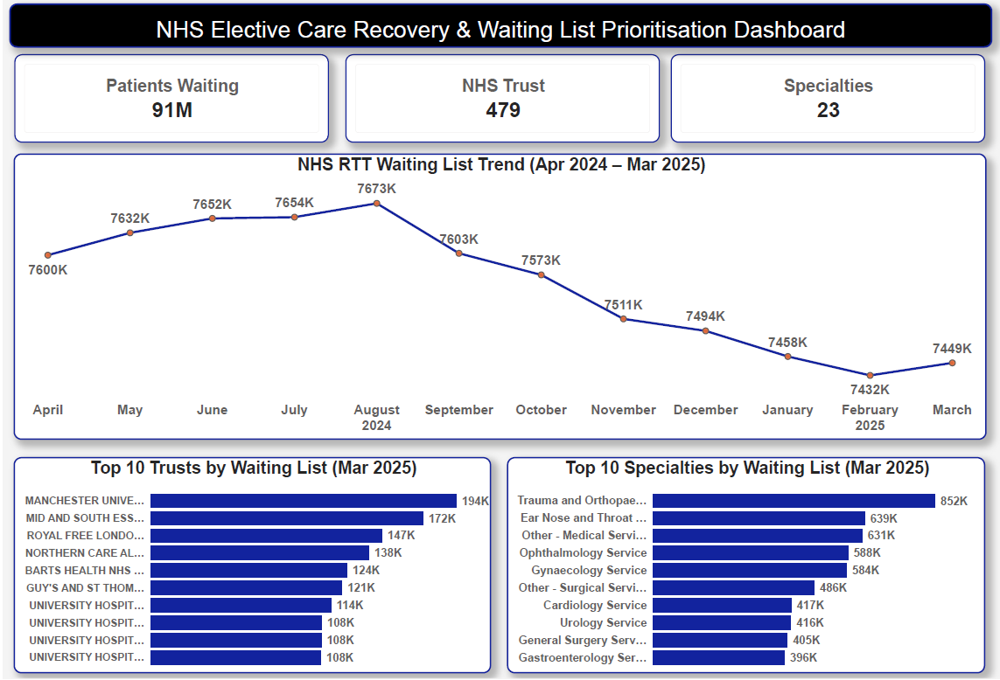
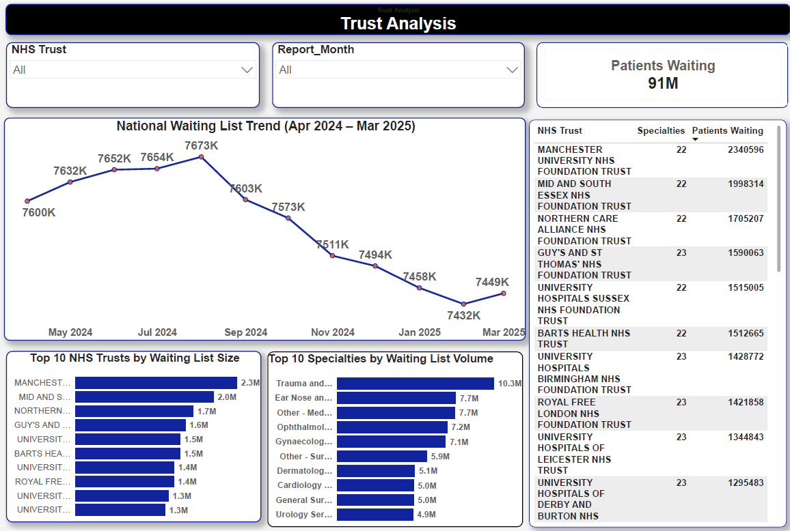
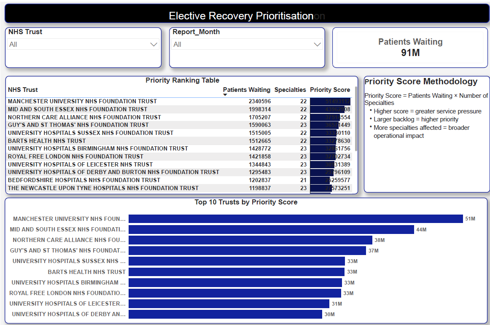

# NHS-Elective-Care-Recovery-Waiting-List-Prioritisation-Dashboard
Power BI dashboard analysing NHS RTT waiting lists, specialty demand, and elective care recovery priorities across NHS Trusts in England.

## 1. Project Overview

This project presents an interactive Power BI dashboard designed to analyse NHS Referral to Treatment (RTT) waiting list performance and support elective care recovery planning across NHS trusts in England. The dashboard provides a comprehensive view of patient waiting lists, specialty demand, trust-level performance, and priority ranking based on waiting list size and service demand.

The analysis combines waiting list volumes and specialty activity to identify NHS trusts experiencing the highest operational pressure and requiring prioritised recovery interventions. Through executive summaries, trust-level analysis, and priority ranking views, the dashboard supports healthcare managers, operational teams, and decision-makers in understanding where resources and recovery efforts may have the greatest impact.

The objective of the project is to improve visibility into elective care backlogs, identify high-priority NHS trusts, and support data-driven decision-making for waiting list recovery and capacity planning.

## 2. Business Questions

The dashboard was designed to answer the following key operational and performance questions:

- What was the total size of the NHS elective care waiting list during the reporting period?

- How did waiting list volumes change between April 2024 and March 2025?

- Which NHS trusts recorded the largest patient waiting lists?

- Which clinical specialties experienced the highest demand and longest waiting lists?

- Which NHS trusts should be prioritised for elective care recovery efforts?

- How does specialty demand vary across NHS trusts?

- Which trusts face the greatest operational pressure based on waiting list size and specialty coverage?

- What trends can be observed in elective care demand over time?

- Which organisations may require additional resources to reduce treatment backlogs?

- How can waiting list data support evidence-based capacity planning and recovery decision-making?

## 3. Data Source

Source: NHS England Referral to Treatment (RTT) Waiting Times Data.

Reporting Period: April 2024 – March 2025.

Coverage: NHS Trusts and Clinical Specialties across England.

Dataset Contents: Reporting period, NHS trust information, treatment function (specialty) codes, specialty names, waiting list volumes, and RTT pathway measures.

### Governance Note

The dataset contains aggregated operational performance data published by NHS England and does not contain any patient-identifiable information. The analysis was conducted using publicly available healthcare performance data to support elective care recovery and waiting list management insights.

## 4. Key KPIs

The dashboard focuses on the following key performance indicators (KPIs):

- Total Patients Waiting

- Number of NHS Trusts

- Number of Clinical Specialties

- Priority Score

- Average Patients Waiting per Trust

- Highest Priority Score

- Average Priority Score

  ### Dashboard Preview

#### Executive Summary Dashboard

#### Executive Summary Dashboard

#### Trust Analysis Dashboard

#### Priority Ranking Dashboard

## 6. Analysis & Insights

The dashboard highlights several important insights regarding NHS elective care demand, waiting list pressures, and trust-level performance during the 2024–25 reporting period.

### Key Findings

- Total patient waiting lists exceeded 90 million records during the reporting period, demonstrating the scale of elective care demand across NHS England.

- Manchester University NHS Foundation Trust recorded the highest waiting list volume and Priority Score, indicating significant operational pressure and recovery requirements.

- Several NHS trusts consistently appeared among the highest-ranked organisations for waiting list size, highlighting opportunities for targeted recovery planning and resource allocation.

- Trauma & Orthopaedics experienced the highest waiting list demand across clinical specialties, indicating sustained pressure on elective services.

- Ear, Nose and Throat (ENT) services also recorded substantial waiting list volumes, contributing significantly to overall elective care demand.

- Waiting list volumes fluctuated throughout the reporting period, highlighting the ongoing challenge of balancing capacity, demand, and recovery efforts.

### Insights by Dashboard Page

#### Executive Summary

The Executive Summary page provides a high-level overview of NHS elective care demand, highlighting waiting list trends, trust-level performance, and specialty pressures across the healthcare system.

#### Trust Analysis

Trust-level analysis reveals considerable variation in waiting list volumes across NHS providers. Several trusts consistently reported substantially larger patient backlogs than others, indicating differences in demand, service capacity, and operational pressure.

#### Priority Ranking

The Priority Ranking page identifies NHS trusts requiring the greatest operational focus by combining waiting list size and specialty coverage into a Priority Score.

This prioritisation model supports evidence-based decision-making by helping healthcare managers identify where elective care recovery initiatives may deliver the greatest impact.

## 7. Tools & Techniques

The project applied a structured data preparation, modelling, and visualisation workflow using Microsoft Power BI.

### Tools & Technologies

#### Power BI Desktop

Dashboard development, data modelling, visualisation, report design, and interactive reporting.

#### Power Query

Data cleansing, transformation, column renaming, date conversion, and data preparation.

#### DAX (Data Analysis Expressions)

Creation of KPI measures including:

- Total Patients Waiting
- NHS Trust Count
- Clinical Specialties Count
- Priority Score
- Average Priority Score
- Highest Priority Score

#### Microsoft Excel

Initial data exploration, validation, pivot table analysis, and data quality checks.

#### Data Visualisation

- KPI Cards
- Line Charts
- Clustered Bar Charts
- Ranking Tables
- Conditional Formatting
- Interactive Slicers
- Multi-Page Dashboard Design

### Techniques Applied

- Data Cleaning and Validation
- Data Transformation
- Data Modelling
- KPI Development
- Waiting List Trend Analysis
- Trust-Level Performance Analysis
- Specialty Demand Analysis
- Priority Scoring Modelling
- Interactive Dashboard Design
- Healthcare Operational Analytics
- Data Storytelling

## 8. Limitations

This analysis is subject to several limitations:

- The dataset represents aggregated operational reporting data and does not provide patient-level information.

- The analysis is limited to the April 2024 – March 2025 reporting period and may not reflect longer-term trends in elective care demand.

- Waiting list figures may be influenced by reporting practices, data submission schedules, and operational changes across NHS trusts.

- The Priority Score is a simplified prioritisation model based on waiting list size and specialty coverage. It does not incorporate factors such as clinical urgency, patient complexity, workforce availability, or treatment outcomes.

- Trust-level comparisons may be influenced by differences in population size, service provision, referral patterns, and organisational structure.

- The analysis focuses on elective care waiting list performance and does not include financial, workforce, or capacity planning data that may influence recovery efforts.

- Specialty-level analysis reflects reported RTT activity and may not fully capture variations in demand across clinical pathways.

## 9. Recommendations

Based on the analysis, the following recommendations may support improved elective care recovery planning and waiting list management across NHS Trusts:

- Prioritise recovery initiatives for NHS trusts with the highest Priority Scores, as these organisations experience both large patient backlogs and broad specialty demand.

- Continue monitoring waiting list trends to identify emerging pressure points and support proactive resource allocation.

- Focus operational improvement programmes on specialties experiencing sustained demand, particularly Trauma & Orthopaedics and Ear, Nose and Throat (ENT) services.

- Use trust-level benchmarking to identify high-performing organisations and share best practices across the NHS.

- Extend the analysis across multiple years to identify seasonal patterns and long-term trends in elective care demand.

- Incorporate additional factors such as workforce capacity, theatre utilisation, diagnostic performance, and clinical urgency into future prioritisation models.

- Combine waiting list data with operational and workforce metrics to support more comprehensive healthcare planning and decision-making.

- Regularly review trust performance to ensure recovery resources are targeted where they can achieve the greatest reduction in patient waiting times.
